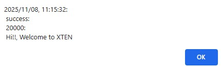

# ระบบ Login ด้วย Angular

## จุดมุ่งหมายของระบบ

ให้ผู้ใช้งาน**กรอก Username** และ **Password** เพื่อเชื่อมต่อระบบ โดยจะมีการดำเนินการ **ตรวจสอบความถูกต้อง**

### กรณีที่ Username และ Password ถูกต้อง

### กรณีที่ Username และ Password ไม่ตรงกัน

---
